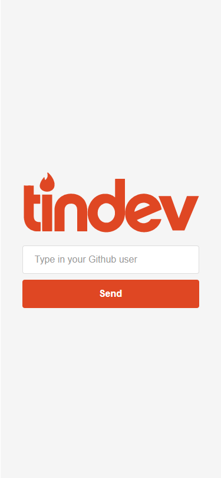
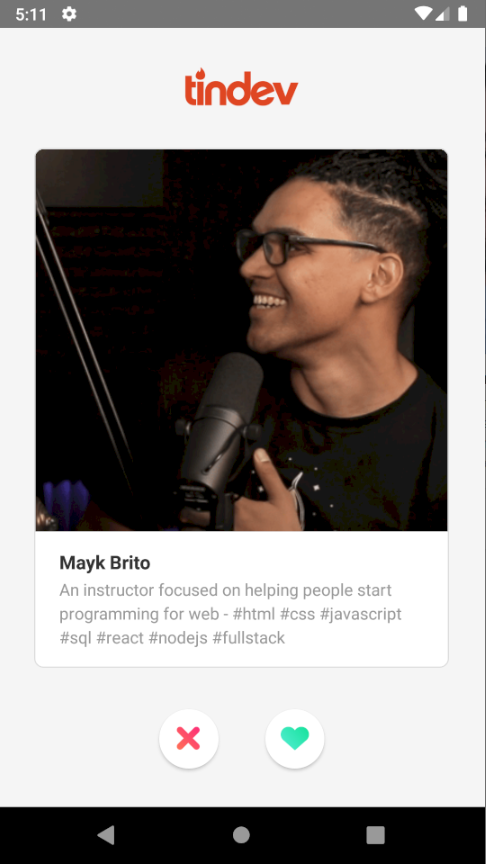
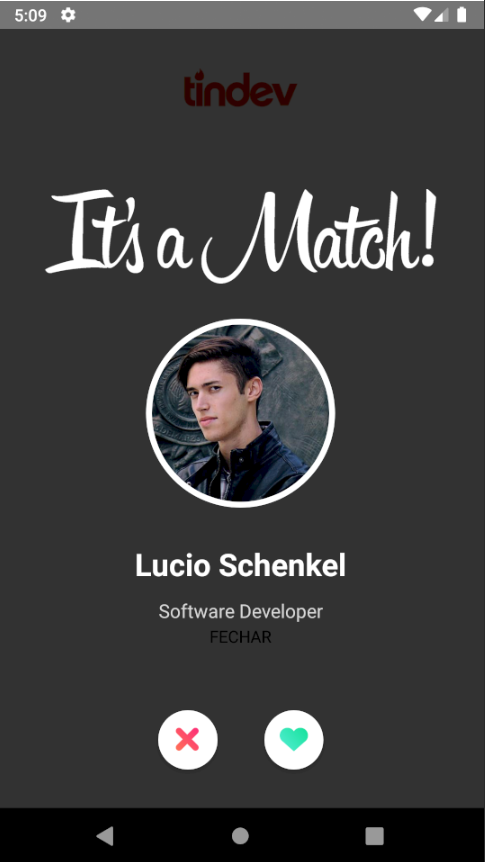

# Tindev

 - [Description](#description)
 - [Images](#images)

<h2 id="description" name=description>Description</h2>

This project consists of three parts:

1. A Nodejs backend;
2. A front end webapp, written in ReactJs;
3. A mobile app written in React Native.

One the app is running, users can log in using a github user name and find other subscribed users. If both users send a "like" to each other, they are going to receive a "it's a match" message, as long as they are currently logged into the app.

<h2 id="running" name=running>Running</h2>

### Requirements

To be able to run all of the app's components, you are going to need the following items installed on your machine:

 - NodeJs
 - Yarn
 - Android Studio
 - React Native's cli
 - AVD

### Backend

Inside the backend folder, duplicate the file ".env.example" and rename the copy to simply ".env":
```bash
cp .env.example .env
```

Inside the recently created ".env" file, replace YOUR_MONGO_URI with a valid mongodb URI, e.g:
```bash
sed -i 's/YOUR_MONGO_URI/mongodb://127.0.0.1:27017/' .env
```

Install the dependencies: 
```bash
yarn install
```
Finally, start the server:
```bash
yarn run dev
```

### Front end

Inside the frontend folder, run:
```bash
yarn install
```
This will install the project's dependencies. Now simply run:
```bash
yarn start
```
After that, the development server should be up and a browser window should pop up presenting you the app.

### Mobile

Inside the tindev folder, run:
```bash
yarn install
```
This will install all the dependencies. After that run one of the following:
```bash
1. yarn run android
```

```bash
2. yarn run ios
```
For those who choose to run the android app, one last step is necessary. In order to tell AVD to map our localhost:3333 running the backend to receive requests from the android virtual machine, we need to enter the following command line:
```bash
adb reverse tcp:3333 tcp:3333
```

<h2 id="images" name=images>Images</h2>



